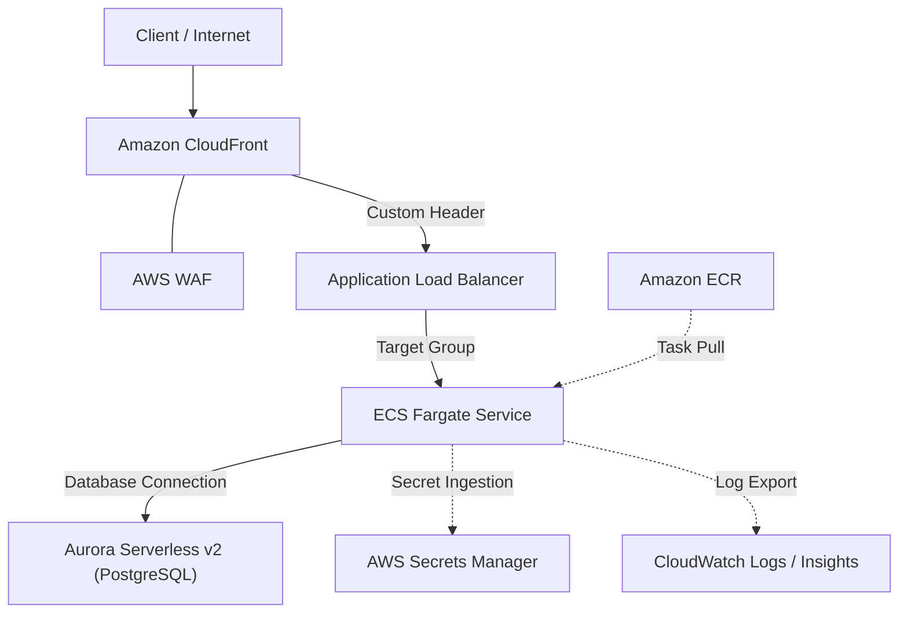

# terraform-aws-fargate-nexus

実務に耐えうる過不足のない堅牢性とシンプルさを両立した、**AWS ECS Fargate + Aurora Serverless v2** によるWeb API向けコンテナインフラストラクチャ基盤です。
KISS原則（Keep It Simple, Stupid）と Security by Design を徹底し、Terraformを用いて再現性の高いマルチAZ構成を実現しています。

---

## 🌟 インフラの特徴・ハイライト

- **3層ネットワーク分離 (Multi-AZ):**
  - Ingress層（Public: ALB）、Compute層（Private: ECS Fargate）、Data層（Isolated: Aurora Serverless v2）の明確な境界分離。
- **堅牢なセキュリティ境界:**
  - CloudFront + AWS WAF によるエッジ防護とカスタムヘッダー検証によるALB直接アクセスの遮断。
  - Security Groupの多段参照による最小権限トラフィック制御。
- **フルマネージド & オートスケール:**
  - ECS FargateによるCPU/メモリ追従型オートスケーリング。
  - Aurora Serverless v2（PostgreSQL）による需要適応型スケーリング（最小0.5 ACU〜）とマルチAZフェイルオーバー。
- **可観測性 & 運用性:**
  - CloudWatch Logs / ECS Container Insights を標準統合。
  - ステート管理の分離設計により、変更リスクに応じた安全な運用を担保。

---

## 🏗️ アーキテクチャ構成図



---

## 📁 ディレクトリ構造

```text
terraform/
├── modules/
│   ├── networking/      # VPC, Subnets, Route Tables, NAT Gateway
│   ├── security/        # Security Groups, IAM Roles
│   ├── ecs_api/         # ECS Cluster, Fargate Task Definition, ALB, Target Group
│   └── database/        # Aurora Serverless v2 (PostgreSQL), Subnet Group
└── environments/
    ├── dev/             # 開発環境（NAT Gateway集約・コスト最適化）
    │   ├── main.tf
    │   ├── variables.tf
    │   ├── outputs.tf
    │   └── terraform.tfvars
    └── prod/            # 本番環境（Multi-AZ NAT Gateway・高可用性構成）
        ├── main.tf
        ├── variables.tf
        ├── outputs.tf
        └── terraform.tfvars
```

---

## 🚀 デプロイ手順

### 1. 前提条件
- Terraform `>= 1.5.0`
- AWS CLI 設定済み（適切な権限を持つIAMロールまたはOIDC設定）

### 2. 初期化と実行

```bash
cd terraform/environments/dev

# バックエンドおよびプラグインの初期化
terraform init

# 実行計画の確認
terraform plan

# インフラのプロビジョニング
terraform apply
```

---

## 👥 キャスト & エンドロール

『AIアプリ工場劇場』のプロフェッショナルたちによって創り上げられました：

- **要件定義 & 構想:** agent🔵
- **仕様策定 & モジュール設計:** agent🍇
- **爆速IaC実装:** agent🍊
- **品質検証 & セキュリティ検査:** agent🟢
- **統括プロデュース:** agent🟡
